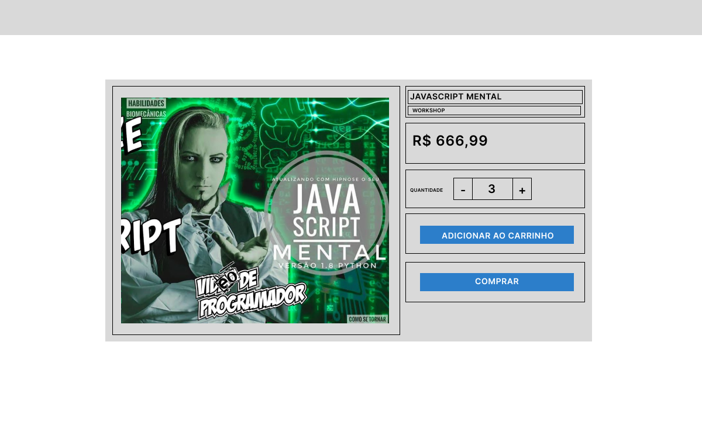

# [US-02]: Página de Detalhes de um Evento
## História do Usuário
Como comprador, eu gostaria de visualizar os detalhes de um evento cadastrado no site e ter a possibilidade de adicionar um determinado número de ingressos para este evento no carrinho ou poder ser redirecionado para a página de pagamento a fim de pagar por eles e adiquri-los.

## Modelo da Interface do Usuário

## Comportamento da Interface
- Os botões de incremento e decremento no input de quantidade permitem ao comprador escolher o total de eventos que ele quer comprar, incrementando ou decrementando de uma em uma unidade. O total também pode ser definido diretamente editando o conteúdo do input, colocado o total de ingressos que se deseja
- Ao clicar no botão "Adicionar ao Carrinho" um ingresso para o evento deve ser adicionado ao carrinho
- Ao clicar em "Comprar" o usuário deve ser redirecionado para a página de pagamento

## Tarefas
## Frontend

<table>
<thead>
<th>ID</th>
<th>Descrição</th>
<th>Atribuição</th>
</thead>

<tbody id="frontend-tasks-tbody">

<tr>
<td>
US-02-FT01
</td>
<td>
Implementar a página de detalhes do evento
</td>
<td>
<a href="https://github.com/gaspar51">gaspar51</a>
</td>
</tr>

<tr>
<td>
US-02-FT02
</td>
<td>
Implementar os testes unitários para página de detalhes do evento
</td>
<td>
<a href="https://github.com/diunkz">diunkz</a>
</td>
</tr>

</tbody>
</table>

### Backend

<table>
<thead>
<th>ID</th>
<th>Descrição</th>
<th>Atribuição</th>
</thead>

<tbody id="backend-tasks-tbody">

<tr>
<td>
US-02-BT01
</td>
<td>
Implementar o endpoint para a exibição dos detalhes do evento
</td>
<td>
<a href="https://github.com/shl0mo">shl0mo</a>
</td>
</tr>

<tr>
<td>
US-02-BT02
</td>
<td>
Implementar os testes unitários para o endpoint de exibição dos detalhes do evento
</td>
<td>
<a href="https://github.com/cleogarcia">cleogarcia</a>
</td>
</tr>

</tbody>
</table>
